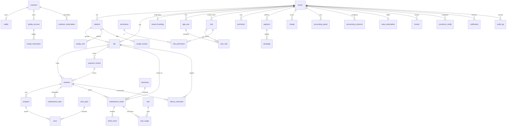

# `core` schema — ERD & data dictionary

The `core` schema is owned by this repo (Drizzle migrations). The data repo owns
`ingest` and `analytics`. Every tenant-scoped table carries `tenant_id` and is
protected by Row-Level Security (`current_setting('app.current_tenant')`); the
app role `app_rw` is **not** `BYPASSRLS`.

Conventions: PKs are **UUIDv7** (`uuidv7()`); money is `amount_cents bigint` +
`currency char(3)`; timestamps are `timestamptz` (UTC); `created_at`/`updated_at`
on most tables, `deleted_at` where soft-delete applies.

## Entity-relationship diagram

## Reference views (stable, for the data repo)

| View | Columns | Purpose |
|---|---|---|
| `core.v_tenant` | id, name, type, status, locale | Tenant reference |
| `core.v_site` | id, tenant_id, network_id, name, city, postal_code, lat, lng, surface_m2, timezone, status | Site reference (incl. OPERAT surface) |
| `core.v_machine` | id, tenant_id, site_id, central_id, kind, brand, model, serial, capacity_kg, status | Machine reference |
| `core.v_price_effective` | id, tenant_id, price_plan_id, program_id, machine_kind, slot, amount_cents, currency | Currently-effective prices |

## Data dictionary (by table)

### Tenancy & org
- **tenant** — id, name, type(`tenant_type`), status(`tenant_status`), locale, created_at, updated_at.
- **network** — id, tenant_id→tenant, name, timestamps. A franchisor/réseau.
- **tenant_branding** — tenant_id(PK)→tenant, app_name, logo_url, primary_color (drives `--primary`).
- **site** — id, tenant_id→tenant, network_id→network?, name, address, city, postal_code, lat, lng, **surface_m2** (OPERAT), timezone(IANA), opening_hours(jsonb), status(`site_status`), opened_at, timestamps, deleted_at.
- **app_user** — id, tenant_id→tenant, cognito_sub(unique), email, full_name, locale, status, last_login_at. Unique (tenant_id, lower(email)).

### RBAC
- **role** — id, tenant_id→tenant? (null = system), key, label, is_system. Unique (tenant_id, key).
- **permission** — id, key(unique, e.g. `M2:reconcile`), label, module.
- **role_permission** — role_id→role, permission_id→permission (PK pair).
- **user_role** — id, user_id→app_user, role_id→role, scope_type(`scope_type`), scope_id. Scope-aware RBAC.

### Assets
- **payment_central** — id, tenant_id→tenant, site_id→site, brand(`payment_central_brand`), model, max_outputs, external_ref, installed_at, status.
- **machine** — id, tenant_id, site_id→site, central_id→payment_central?, kind(`machine_kind`), brand(`machine_brand`), model, serial, capacity_kg, install_date, warranty_until, expected_life_cycles, status(`machine_state`), external_ref. Unique (tenant_id, serial); partial index on `out_of_service`.
- **program** — id, tenant_id, machine_id→machine? (null = catalog), code, label, default_duration_min, kind.

### Pricing
- **price_plan** — id, tenant_id→tenant, site_id→site?, name, active.
- **price** — id, tenant_id, price_plan_id→price_plan, machine_kind?, machine_id?, program_id?, slot(`price_slot`), amount_cents, currency, valid_from, valid_to.
- **promotion** — id, tenant_id, label, scope, type, value, schedule(jsonb), active, starts_at.

### Customers & loyalty
- **customer** — id, tenant_id, external_auth_id?, email?, phone?, first_seen_at, consent(jsonb), deleted_at. RGPD-minimal.
- **wallet** — id, tenant_id, customer_id→customer, balance_cents, currency.
- **loyalty_account** — id, tenant_id, customer_id→customer, points, tier(`loyalty_tier`).
- **loyalty_transaction** — id, tenant_id, loyalty_account_id→loyalty_account, delta, reason, ref, created_at.
- **customer_subscription** — id, tenant_id, customer_id→customer, plan, status, period.
- **segment** — id, tenant_id, name, definition(jsonb).
- **campaign** — id, tenant_id, label, channel(`campaign_channel`), segment_id→segment?, content, schedule, status.

### Maintenance
- **technician** — id, tenant_id, user_id→app_user?, name, type(`technician_type`), contact.
- **maintenance_ticket** — id, tenant_id, site_id→site, machine_id→machine?, source(`ticket_source`), priority(`ticket_priority`), status(`ticket_status`), title, description, probable_cause, assigned_technician_id→technician?, sla_due_at, opened_at, resolved_at. Partial index on open statuses.
- **ticket_event** — id, tenant_id, ticket_id→maintenance_ticket, type, note, by_user_id→app_user?, created_at.
- **maintenance_plan** — id, tenant_id, machine_id→machine, trigger(`maintenance_plan_trigger`), threshold, last_done_at, next_due_at.
- **part** / **part_usage** — parts stock and per-ticket consumption (Could).

### Finance
- **charge** — id, tenant_id, site_id→site?, type(`charge_type`), amount_cents, currency, period, recurring.
- **accounting_export** — id, tenant_id, kind(`accounting_export_kind`), period, status, file_s3_key, created_by→app_user?.
- **accounting_connector** — id, tenant_id, provider(`accounting_provider`), config(jsonb), secret_ref (Secrets Manager ARN), status.
- **royalty_rule** / **royalty_invoice** — network royalties (Could).
- **saas_subscription** / **invoice** — Stripe SaaS billing for the platform itself.

### Integrations, commands, ops, audit
- **connector_config** — id, tenant_id, site_id?, kind(`connector_kind`), provider, config(jsonb), secret_ref, status(`connector_status`), last_sync_at, last_error. Drives the connectors UI.
- **device_command** — id, tenant_id, site_id→site, machine_id→machine, type(`device_command_type`), payload(jsonb), status(`device_command_status`), requested_by→app_user?, created_at, executed_at. **App writes; data repo consumes.**
- **notification** — id, tenant_id, user_id→app_user?, severity(`notification_severity`), type, title, body, link, read_at, created_at.
- **audit_log** — id, tenant_id, user_id→app_user?, action, entity_type, entity_id, before(jsonb), after(jsonb), ip, created_at.

## Partitioning expectation (cross-repo contract)

High-volume telemetry/event tables live in the data repo's `ingest` schema
(`ingest.machine_status_current`, `ingest.cycle_event`, …) and use **bigint
identity** PKs with **monthly range partitioning** on the event timestamp. `core`
tables here are low-volume entity tables and are not partitioned. Dashboards read
pre-aggregated `analytics.site_kpi_daily` rather than scanning event tables.
